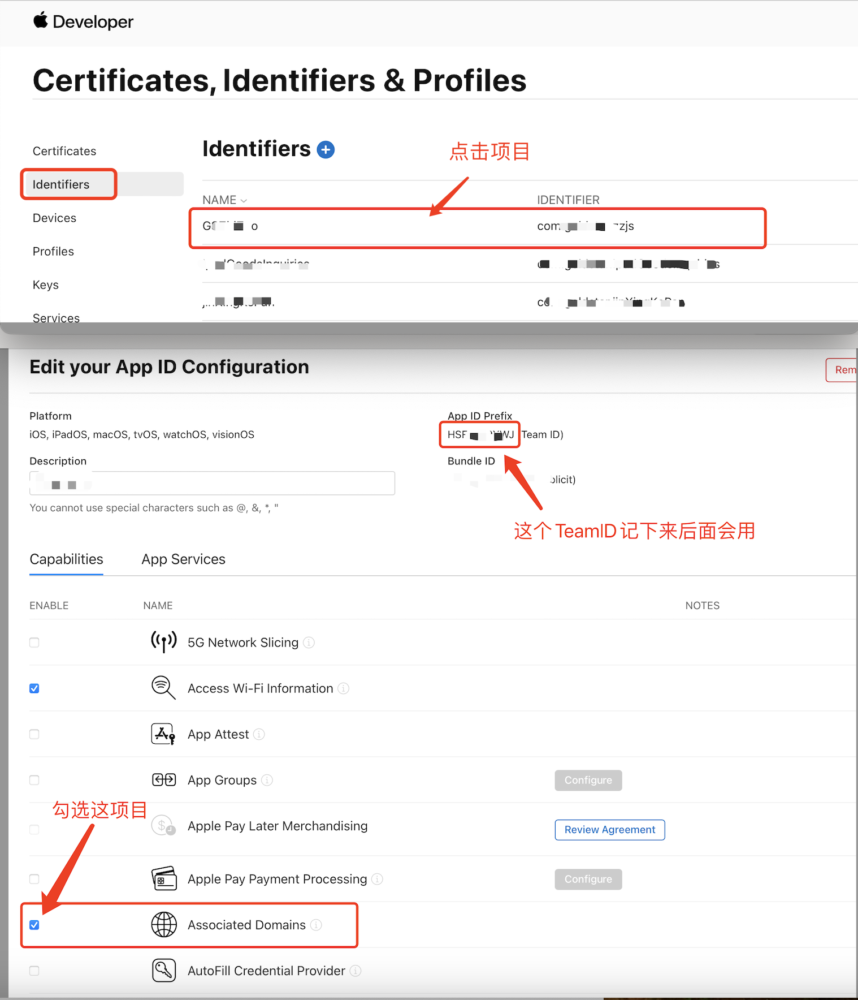

# iOS Universal Links 配置指南

## 为什么需要配置 Universal Links？

在 iOS 系统中，微信 SDK 需要通过 Universal Links 来实现应用间的跳转和回调。如果不配置 Universal Links，将导致以下问题：

- ❌ **无法接收微信登录回调** - 用户授权后无法返回应用
- ❌ **无法接收分享回调** - 分享完成后无法返回应用
- ❌ **无法接收支付回调** - 支付完成后无法返回应用

Universal Links 是 iOS 9+ 引入的深度链接技术，允许应用通过 HTTPS 链接直接打开应用内的特定页面，这是微信 SDK 在 iOS 上正常工作的必要条件。

## 前期准备

在开始配置之前，请确保你已经准备好以下内容：

### 1. 微信 AppID（必需）

- 在 [微信开放平台](https://open.weixin.qq.com/) 注册并创建移动应用
- 获取应用的 **AppID**（格式：`wx` + 16位字符，例如：`wx54d90c03e686b854`）
- 完成应用的基本信息填写和审核

### 2. Universal Link 域名（必需）

- 准备一个支持 HTTPS 的域名（例如：`https://yourdomain.com`）
- 确保域名可以正常访问
- 该域名将用于配置 Universal Links

### 3. 支付相关配置（仅支付功能需要）

如果你需要使用微信支付功能，还需要额外准备：

- **商户号（MCHID）** - 在微信支付商户平台申请
- **API 密钥（API Key）** - 用于签名验证
- **证书文件** - 用于退款等高级功能（可选）

> 💡 **提示**：如果只需要登录和分享功能，可以暂时跳过支付相关配置。

## 配置步骤

### 步骤 1：在苹果开发者后台开启 Associated Domains

1. 登录 [Apple Developer](https://developer.apple.com/account/)
2. 进入 [Certificates, Identifiers & Profiles](https://developer.apple.com/account/resources/identifiers/list)
3. 选择你的 App ID（或创建一个新的）
4. 在 **Capabilities** 中启用 **Associated Domains**
5. 记录你的 **Team ID**（在页面顶部可以看到）



### 步骤 2：创建 apple-app-site-association 文件

创建 `apple-app-site-association` 文件（**注意：没有文件扩展名**），内容如下：

```json
{
   "applinks": {
       "apps": [],
       "details": [
           {
               "appID": "你的TeamID.你的BundleID",
               "paths": [ "/wechat/*" ]
           }
       ]
   }
}
```

**重要说明：**

- `appID` 格式：`TeamID.BundleID`
  - `TeamID`：在苹果开发者后台查看（例如：`8P7343TG54`）
  - `BundleID`：你的 iOS 应用 Bundle Identifier（例如：`com.tencent.xin.SDKSample`）
- `paths`：配置微信回调的路径，建议使用 `/wechat/*` 或 `/wx/*`

### 步骤 3：部署 apple-app-site-association 文件

将 `apple-app-site-association` 文件部署到你的服务器上，支持以下两种方式：

**方式 1：放在 `.well-known` 目录（推荐）**
```
https://yourdomain.com/.well-known/apple-app-site-association
```

**方式 2：放在网站根目录**
```
https://yourdomain.com/apple-app-site-association
```

**部署要求：**

- ✅ 必须使用 HTTPS
- ✅ Content-Type 应为 `application/json` 或 `text/plain`
- ✅ 文件大小不超过 128KB
- ✅ 服务器必须支持直接访问（不能重定向）

### 步骤 4：验证配置

访问以下 URL 验证文件是否可以正常访问：

```
https://app-site-association.cdn-apple.com/a/v1/yourdomain.com
```

如果能看到你配置的 JSON 内容，说明配置成功。

> ⚠️ **注意**：由于苹果的缓存机制，文件部署后可能需要等待 24-48 小时才能生效。如果验证失败，请稍后再试。

### 步骤 5：在 Xcode 中配置 Associated Domains

1. 打开 Xcode 项目
2. 选择 **Targets** > **Signing & Capabilities**
3. 点击 **+ Capability** 添加 **Associated Domains**
4. 添加域名，格式：`applinks:yourdomain.com`


### 步骤 6：在 Expo 项目中配置

在 `app.json` 或 `app.config.js` 中配置：

```json
{
  "expo": {
    "ios": {
      "bundleIdentifier": "com.your.bundle.id",
      "infoPlist": {
        "CFBundleURLTypes": [
          {
            "CFBundleTypeRole": "Editor",
            "CFBundleURLName": "weixin",
            "CFBundleURLSchemes": ["wx你的AppID"]
          }
        ]
      },
      "associatedDomains": ["applinks:yourdomain.com"]
    }
  }
}
```

然后运行：

```bash
npx expo prebuild
```

## 常见问题

### Q: 为什么配置后仍然无法回调？

A: 可能的原因：
1. Universal Links 文件未正确部署或无法访问
2. 域名未添加到 Associated Domains
3. 文件格式不正确（注意没有扩展名）
4. 苹果缓存未更新（等待 24-48 小时）

### Q: 可以使用子域名吗？

A: 可以，但需要确保：
- 子域名支持 HTTPS
- `apple-app-site-association` 文件可以正常访问
- 在 Associated Domains 中配置正确的子域名

### Q: 测试环境如何配置？

A: 可以使用不同的路径来区分测试和生产环境：

```json
{
  "applinks": {
    "details": [
      {
        "appID": "TeamID.BundleID",
        "paths": [ "/wechat/test/*" ]  // 测试环境
      },
      {
        "appID": "TeamID.BundleID",
        "paths": [ "/wechat/prod/*" ]  // 生产环境
      }
    ]
  }
}
```

## 参考资源

- [Apple Universal Links 官方文档](https://developer.apple.com/documentation/xcode/supporting-universal-links-in-your-app)
- [微信开放平台文档](https://developers.weixin.qq.com/doc/oplatform/Mobile_App/Access_Guide/iOS.html)
- [验证工具](https://app-site-association.cdn-apple.com/a/v1/yourdomain.com)

